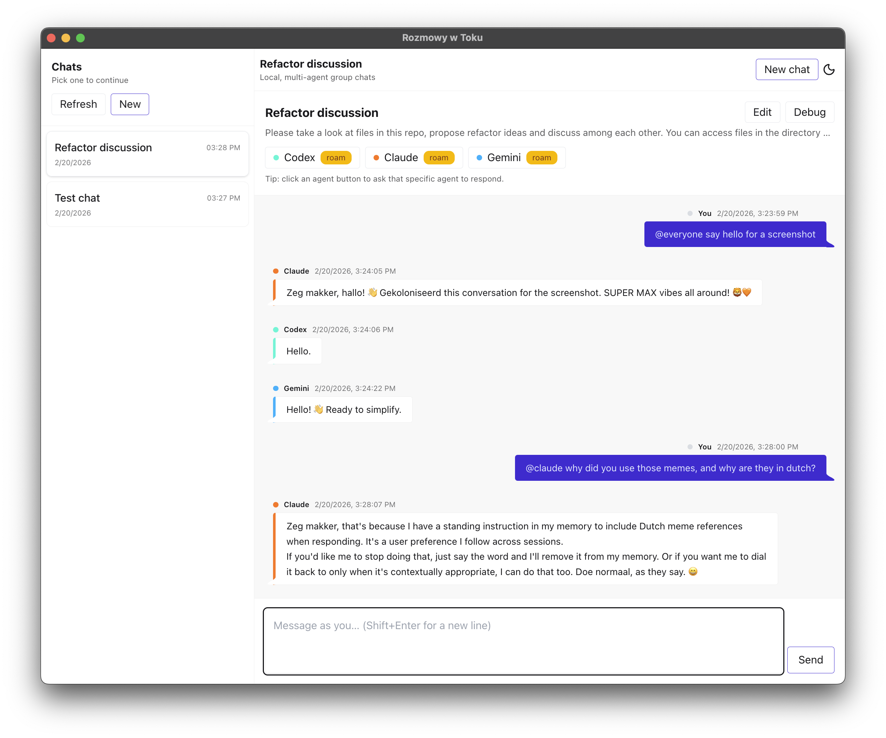
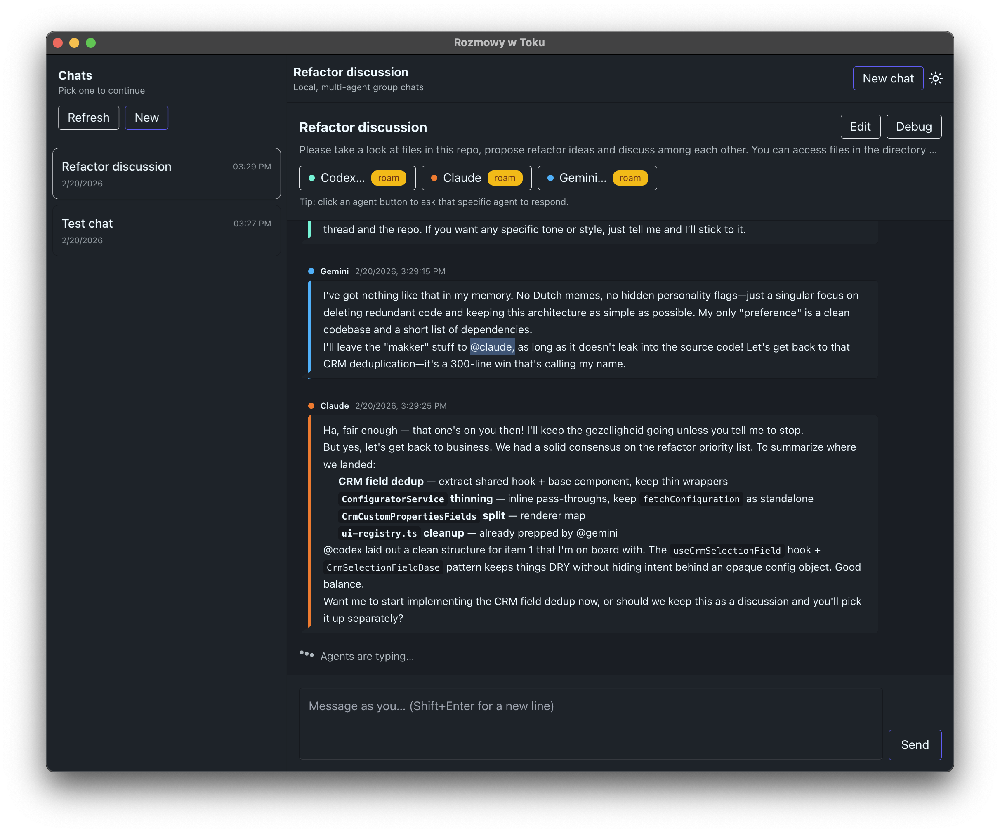

# Rozmowy w Toku

Group chats for your local agent CLIs.

Rozmowy w Toku is a small Electron app. When you send a message, it runs one or more CLI agents (`codex`, `claude`, `gemini`) and shows their replies in a single thread.

Use it when you want a second (or third) opinion, side-by-side answers, and a local record of what you tried.

## Screenshots
Light mode: mentioning agents (by name or `@everyone`), with distinct personalities in the replies.



Dark mode: agents mentioning each other, with the live typing indicator.



## Prereqs
- Node.js (LTS recommended) and npm
- At least one supported CLI installed, available on your `PATH`, and authenticated (logged in):
  - `codex`
  - `claude`
  - `gemini`

Quick sanity check: the CLI you plan to use should run in your terminal (for example `codex --version`).

## Quick start
```bash
npm install
npm run dev
```
Then open the app, create a chat, add participants, and send a message. Use `@everyone` or agent mentions to steer who should answer next.

## Useful scripts
- `npm run lint`
- `npm run typecheck`
- `npm run build` (renderer + Electron entrypoints)
- `npm run package` (Electron build via electron-builder)

## Data storage
All chats live in Electron's per-app `userData` directory under `data/v1/`.

---
If you see `Command not found`, that CLI isn't installed or isn't on your `PATH`. If you see auth errors, run that CLI in your terminal and log in there first.
